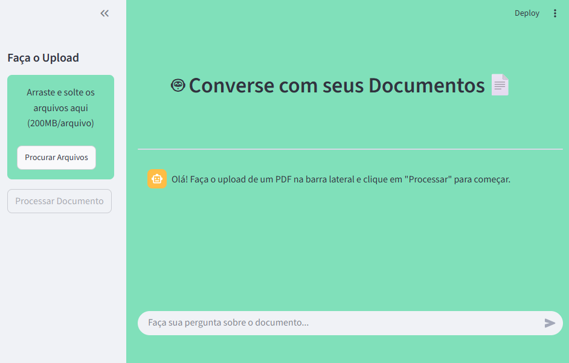

# 🤖 Projeto: Converse com os seus Documentos

<div align="center">

</div>

Este projeto é uma aplicação web construída com Streamlit e LangChain que permite aos utilizadores fazer o upload de um documento PDF e interagir com ele através de um chat inteligente. A aplicação extrai o conteúdo do PDF, cria uma base de conhecimento e utiliza um modelo de linguagem da OpenAI para responder a perguntas sobre o documento.

✨ Funcionalidades
- Upload de PDF: Interface simples para carregar um documento PDF.

- Processamento Inteligente: Utiliza o LangChain para dividir o texto, criar embeddings vetoriais e preparar uma cadeia de perguntas e respostas (QA).

- Chat Interativo: Interface de chat para conversar com o documento de forma natural.

- Limpeza Automática: O histórico da conversa e os dados do PDF são limpos automaticamente quando o ficheiro é removido.

- Interface Personalizada: A aparência do componente de upload é personalizada com CSS para uma melhor experiência do utilizador.

🛠️ Tecnologias Utilizadas
- Python: Linguagem de programação principal.
- Streamlit: Framework para a criação da interface web interativa.
- LangChain: Framework para o desenvolvimento de aplicações com modelos de linguagem.
- OpenAI: Para o acesso aos modelos de linguagem (GPT-4o-mini).
- FAISS: Biblioteca para busca de similaridade eficiente em vetores.

📁 Estrutura do Projeto
O projeto foi simplificado para facilitar a execução e o entendimento, utilizando uma estrutura com um único script principal:

```bash
.
├── 📁 .streamlit/
│   └── 📄 config.toml   # Ficheiro de configuração do tema do Streamlit
├── 🖼️ img/
│   └── 📄 ocr.png       # Imagem de demonstração para o README
├── 📄 .env              # Ficheiro para armazenar a chave da API (não versionado)
├── 📄 .gitignore        # Ficheiro para ignorar ficheiros e pastas no Git
├── 📜 main.py           # Script principal que contém toda a lógica da aplicação
├── 🎨 custom_css.py     # Ficheiro de estilo para personalizar a aparência
└── 📋 requirements.txt  # Lista de dependências Python do projeto
```

- `main.py`: Contém toda a lógica da aplicação, desde a configuração, o processamento do PDF e a construção da interface do utilizador com o Streamlit.

🚀 Como Executar o Projeto
Siga os passos abaixo para executar a aplicação localmente.

1. Clonar o Repositório

```bash
git clone https://github.com/Hevenicio/CIIA.git
```

2. Criar e Ativar um Ambiente Virtual

É uma boa prática usar um ambiente virtual para isolar as dependências do projeto.

```bash
# Criar o ambiente
python -m venv venv

# Ativar no Windows
.\venv\Scripts\activate

# Ativar no macOS/Linux
source venv/bin/activate
```

3. Instalar as Dependências

Crie um ficheiro `requirements.txt` com o seguinte conteúdo:

```bash
streamlit
langchain
langchain-openai
langchain-community
faiss-cpu
pypdf
python-dotenv
```

E instale todas as bibliotecas com um único comando:

```bash
pip install -r requirements.txt
```

4. Configurar a Chave de API

- Crie um ficheiro chamado .env na raiz do projeto.
- Dentro deste ficheiro, adicione a sua chave da API da OpenAI:

```bash
OPENAI_API_KEY="sk-sua-chave-aqui"
```

5. Executar a Aplicação

Com o ambiente virtual ativado, execute o seguinte comando no terminal:

```bash
streamlit run main.py
```

A aplicação será aberta automaticamente no seu navegador web.