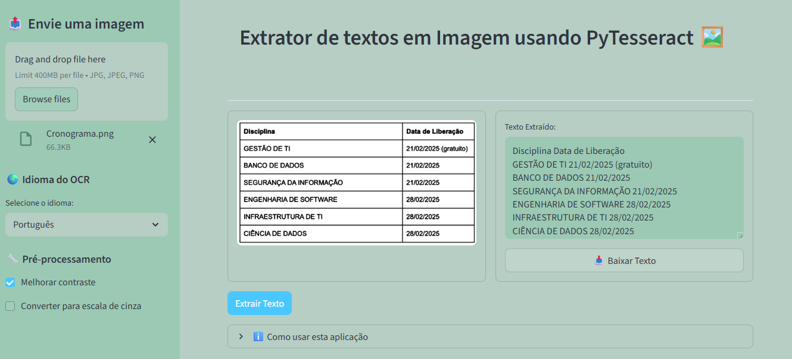

# 🖼️ Projeto: Extrator de Texto de Imagens (OCR)

<div align="center">

</div>

Este projeto é uma aplicação web construída com **Streamlit** que utiliza **PyTesseract** para extrair texto de imagens. A ferramenta permite que os usuários façam o upload de um ficheiro de imagem, apliquem pré-processamentos básicos e extraiam o conteúdo textual de forma rápida e eficiente.

### ✨ Funcionalidades

-   **Upload de Imagens**: Interface simples para carregar imagens nos formatos `JPG`, `JPEG` e `PNG`.
-   **Suporte Multilíngue**: Extrai texto em diferentes idiomas, como Português, Inglês e Espanhol.
-   **Pré-processamento de Imagem**: Opções para melhorar o contraste e converter a imagem para escala de cinza, otimizando a precisão do OCR.
-   **Visualização Lado a Lado**: Permite comparar a imagem original com o texto extraído diretamente na interface.
-   **Download do Resultado**: Oferece um botão para baixar o texto extraído como um ficheiro `.txt`.
-   **Interface Intuitiva**: Construída com Streamlit para uma experiência de utilizador limpa e direta.

### 🛠️ Tecnologias Utilizadas

-   **Python**: Linguagem de programação principal.
-   **Streamlit**: Framework para a criação da interface web interativa.
-   **PyTesseract**: Wrapper Python para o Tesseract-OCR Engine, utilizado para a extração de texto.
-   **Pillow (PIL)**: Biblioteca para manipulação de imagens.
-   **NumPy**: Utilizado para a conversão de imagens em arrays.

### 📁 Estrutura do Projeto

O projeto está organizado da seguinte forma:
```bash
.
├── 📁 .streamlit/
│   └── 📄 config.toml    # Ficheiro de configuração do tema do Streamlit
├── 📄 .gitignore         # Ficheiro para ignorar ficheiros e pastas no Git
├── 🖼️ img/
│   └── 📄 ocr.png        # Imagem de demonstração para o README
├── 📜 app.py             # Script principal que contém a lógica da aplicação
└── 📋 requirements.txt   # Lista de dependências Python do projeto
```


-   `app.py`: Contém toda a lógica da aplicação, incluindo a interface do utilizador e o processamento de OCR.

### 🚀 Como Executar o Projeto

Siga os passos abaixo para executar a aplicação localmente.

#### 1. Pré-requisitos (Tesseract OCR)

O `pytesseract` requer que o **Tesseract OCR Engine** esteja instalado no seu sistema.

-   **Windows**: Faça o download do instalador na [documentação oficial do Tesseract](https://github.com/tesseract-ocr/tessdoc).
-   **Linux (Debian/Ubuntu)**:
    ```bash
    sudo apt update && sudo apt install tesseract-ocr tesseract-ocr-por
    ```
-   **macOS (via Homebrew)**:
    ```bash
    brew install tesseract tesseract-lang
    ```

#### 2. Clonar o Repositório

```bash
git clone https://github.com/Hevenicio/CIIA/tree/main/02%20-%20OCR
```

#### 3. Criar e Ativar um Ambiente Virtual

```bash
# Criar o ambiente
python -m venv .venv

# Ativar no Windows
.\.venv\Scripts\activate

# Ativar no macOS/Linux
source .venv/bin/activate
```

#### 4. Instalar as Dependências
```bash
pip install -r requirements.txt
```

#### 5. Executar a Aplicação
Com o ambiente virtual ativado, execute o seguinte comando no terminal:

```bash
streamlit run app.py
```
A aplicação será aberta automaticamente no seu navegador web.