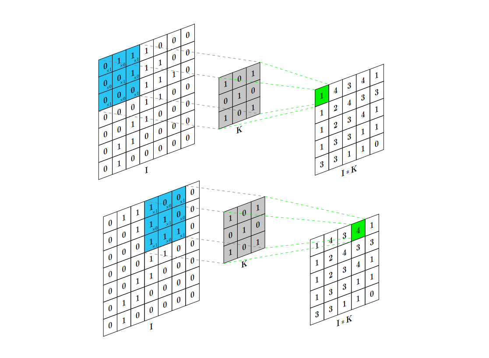

# O que são Redes Neurais Convolucionais (CNNs)?

Redes Neurais Convolucionais (Convolutional Neural Network - CNN, em inglês) são arquiteturas de aprendizado profundo projetadas para processamento de dados com estrutura espacial, como imagens. O grande diferencial das CNNs é a habilidade de identificar automaticamente características relevantes nas imagens, sem precisar de intervenção humana para esse processo. A CNN é composta por camadas
específicas, cada uma desempenhando uma função essencial no aprendizado e extração
de características.

A ordem das camadas em uma CNN pode variar dependendo da arquitetura específica, mas geralmente segue a especificada na Figura 1.

  <figcaption><b>Figura 1:</b> Diagrama representando uma Rede Neural Convolucional (CNN).</figcaption>

## As principais etapas de funcionamento de uma CNN são:

- Camada de Entrada: recebe e prepara a imagem, transformando cada pixel em um valor processável;

- Camadas de Convolução: as camadas de convolução são a essência das CNNs.
Cada camada de convolução é composta por um conjunto de filtros (ou kernels) que deslizam pela imagem, calculando a convolução entre o filtro e uma região localizada na imagem. Essa operação de convolução resulta em mapas de características que destacam a presença de características específicas, como bordas, texturas ou padrões em diferentes partes da imagem. Cada filtro aprende a detectar um tipo particular de característica, e a rede combina múltiplos filtros para capturar uma variedade de características em várias escalas e níveis de abstração. A Figura 2 esquematiza esse conceito;

<figcaption><b>Figura 2:</b> Um exemplo de convolução entre entrada I(7×7×1) e um kernel
K(3×3×1) com passo de 1.</figcaption>

- Camadas de Ativação: após cada camada de convolução, é aplicada uma função
de ativação não linear para introduzir não linearidade e melhorar a capacidade de aprendizado na rede. A função de ativação é aplicada elemento a elemento aos
mapas de características gerados pela convolução. A função ReLU é amplamente
usada nas CNNs.

- Camadas de Pooling: estas camadas são responsáveis por reduzir a dimensionalidade espacial dos mapas de características gerados pelas camadas de convolução. O pooling é uma técnica que divide o mapa de características em regiões e realiza uma operação, como selecionar o valor máximo (max pooling) ou calcular a média (average pooling), para obter um valor representativo para cada região. Essa redução da resolução espacial permite que a rede se torne mais robusta a pequenas variações na posição das características e também reduz o número de parâmetros na rede, tornando-a mais eficiente computacionalmente.

- Camadas Totalmente Conectadas: estas camadas finais são responsáveis por mapear as características extraídas para as classes de destino. Elas incorporam a capacidade de generalização da rede neural, permitindo que a rede tome decisões finais com base nas características aprendidas durante o treinamento.

- Camada de Saída: apresenta o resultado, como a classe da imagem identificada (ex: “cachorro” ou “gato”).