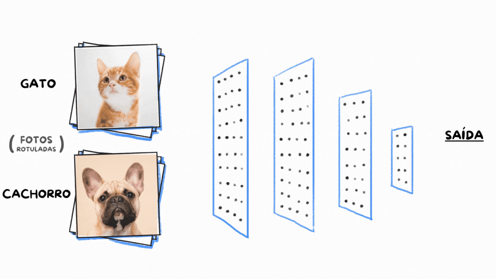
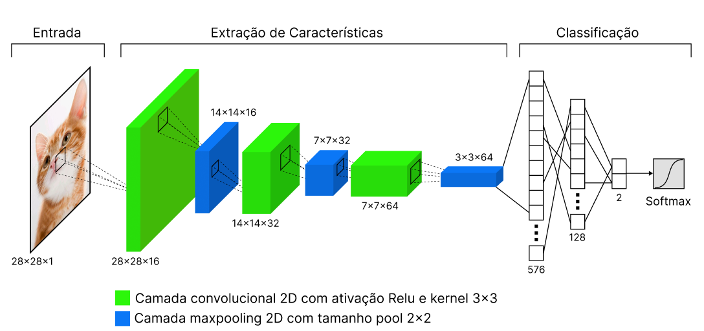
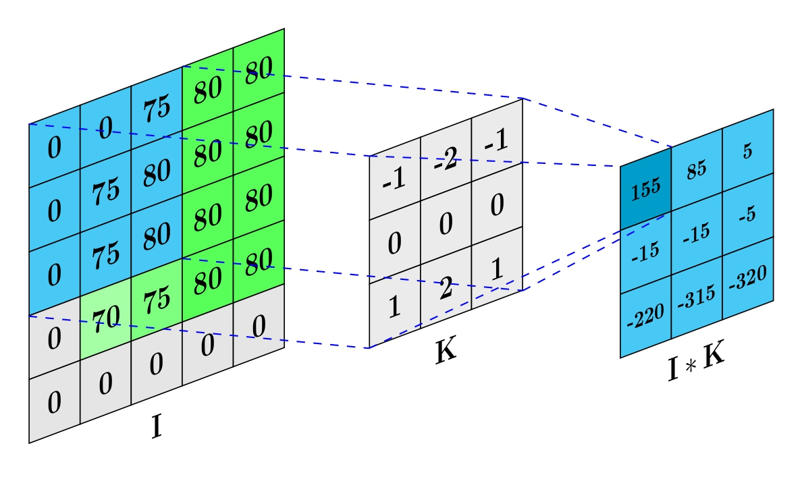
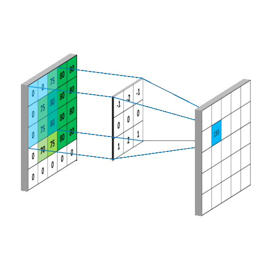
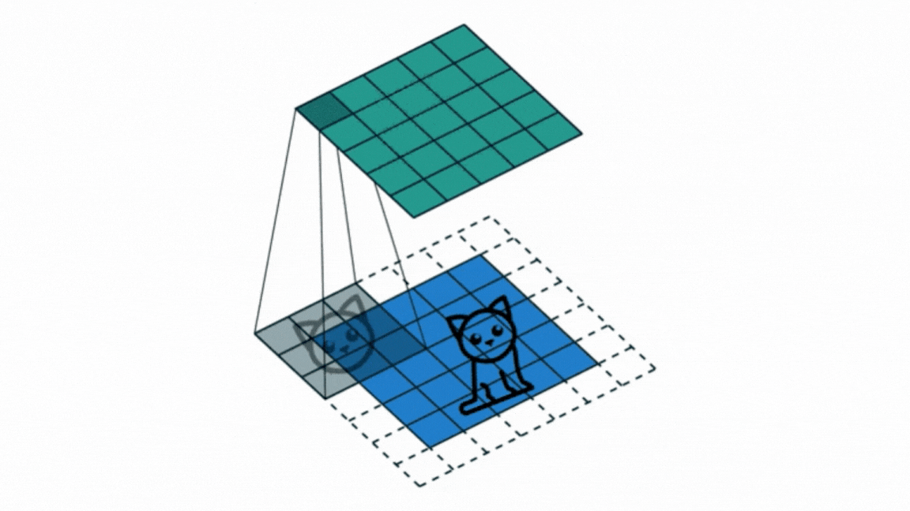
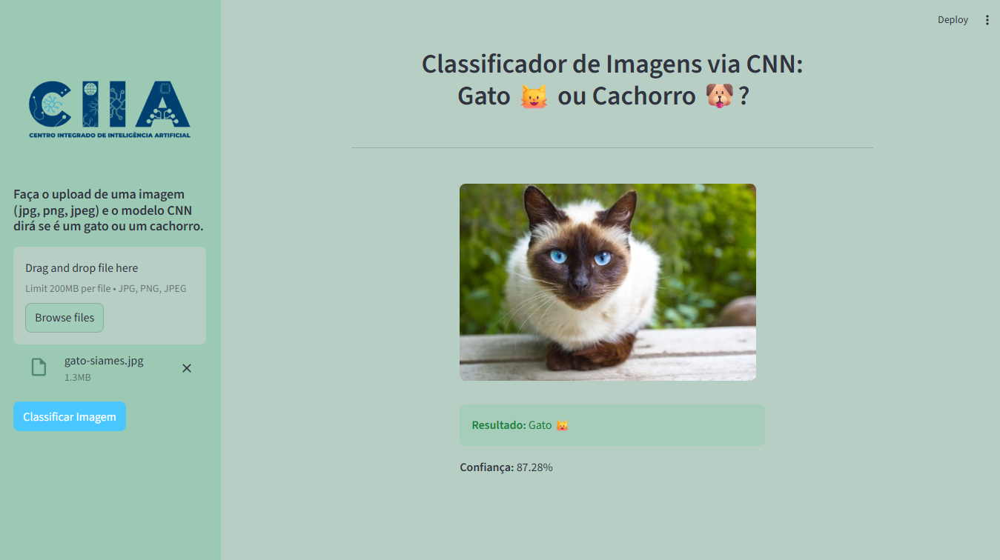

  

# O que são Redes Neurais Convolucionais (CNNs)?

Redes Neurais Convolucionais (Convolutional Neural Network - CNN, em inglês) são arquiteturas de aprendizado profundo projetadas para processamento de dados com estrutura espacial, como imagens. O grande diferencial das CNNs é a habilidade de identificar automaticamente características relevantes nas imagens, sem precisar de intervenção humana para esse processo. A CNN é composta por camadas
específicas, cada uma desempenhando uma função essencial no aprendizado e extração
de características.

###

A ordem das camadas em uma CNN pode variar dependendo da arquitetura específica, mas geralmente segue a especificada na Figura 1.

   
  <b>Figura 1:</b> Diagrama representando uma Rede Neural Convolucional (CNN).

## As principais etapas de funcionamento de uma CNN são:

- **Camada de Entrada:** recebe e prepara a imagem, transformando cada pixel em um valor processável;

- **Camadas de Convolução:** as camadas de convolução são a essência das CNNs.
Cada camada de convolução é composta por um conjunto de filtros (ou kernels) que deslizam pela imagem, calculando a convolução entre o filtro e uma região localizada na imagem. Essa operação de convolução resulta em mapas de características que destacam a presença de características específicas, como bordas, texturas ou padrões em diferentes partes da imagem. Cada filtro aprende a detectar um tipo particular de característica, e a rede combina múltiplos filtros para capturar uma variedade de características em várias escalas e níveis de abstração. A Figura 2 esquematiza esse conceito;

###

   
  <b>Figura 2:</b> Um exemplo de convolução entre entrada I(5×5×1) e um kernel K(3×3×1) com passo de 1.

###
Abaixo temos ilustrações esquematizam como esse processo acontece:

  
  

###
- **Camadas de Ativação:** após cada camada de convolução, é aplicada uma função
de ativação não linear para introduzir não linearidade e melhorar a capacidade de aprendizado na rede. A função de ativação é aplicada elemento a elemento aos mapas de características gerados pela convolução. A função ReLU (Rectified Linear Unit, em inglês) é amplamente usada nas CNNs.

  - **Por que ReLU é a escolha padrão?**
  
      - A função **ReLU** é amplamente usada nas CNNs modernas, definida como `f(x) = max(0, x)`. Embora funções clássicas como Sigmoid e Tanh tenham sido usadas historicamente, elas apresentam o **problema do gradiente desaparecente**: suas derivadas são limitadas a valores pequenos (Sigmoid entre 0 e 0,25, Tanh entre 0 e 1), fazendo com que os gradientes se tornem exponencialmente menores durante a retropropagação em redes profundas, dificultando o aprendizado nas camadas iniciais, a Figura 3 esquematiza a comparação dessas três funções.
      
      - A ReLU resolve esse problema porque sua derivada é constantemente 1 para entradas positivas, permitindo que os gradientes fluam sem perder intensidade através de múltiplas camadas. Além disso, ReLU é computacionalmente eficiente (apenas uma operação de comparação) e promove **esparsidade** na rede ao desativar neurônios com entradas negativas, o que funciona como uma forma de regularização implícita. Essas vantagens tornaram possível o treinamento de redes muito profundas, como ResNet e VGG, que seriam impraticáveis com sigmoid ou tanh.

      

         
        <b>Figura 3:</b> Comparação entre funções de ativação: Sigmoid, Tanh e ReLU.
      

###

- **Camadas de Pooling:** estas camadas são responsáveis por reduzir a dimensionalidade espacial dos mapas de características gerados pelas camadas de convolução. O pooling é uma técnica que divide o mapa de características em regiões e realiza uma operação, como selecionar o valor máximo (max pooling) ou calcular a média (average pooling), para obter um valor representativo para cada região. Essa redução da resolução espacial permite que a rede se torne mais robusta a pequenas variações na posição das características e também reduz o número de parâmetros na rede, tornando-a mais eficiente computacionalmente.

###

- **Camadas Totalmente Conectadas:** estas camadas finais são responsáveis por mapear as características extraídas para as classes de destino. Elas incorporam a capacidade de generalização da rede neural, permitindo que a rede tome decisões finais com base nas características aprendidas durante o treinamento.

###

- **Camada de Saída:** apresenta o resultado, como a classe da imagem identificada (ex: “cachorro” ou “gato”).

🚀 Aplicação: Projeto Streamlit

Para demonstrar esses conceitos em ação, desenvolvi uma aplicação web interativa usando Streamlit!

   

Foi utilizado um modelo CNN (com arquitetura Keras/TensorFlow) treinado para classificar imagens de gatos 🐱 e cachorros 🐶.
Nele é possível fazer o upload da sua própria imagem e ver o modelo tomar a decisão em tempo real, mostrando a classe prevista e o nível de confiança.
Foi um projeto excelente para demonstrar o conhecimento teórico e transformá-lo em uma ferramenta prática e funcional.

🔗 Convido você a testar o app e explorar o código-fonte completo no meu repositório do GitHub:
[REPOSITÓRIO GITHUB](https://github.com/Hevenicio/CIIA/tree/main/04%20-%20Classificador%20de%20Imagens%20com%20CNN)

#DeepLearning  #InteligenciaArtificial #IA #CNN #Python #Streamlit #TensorFlow #Keras #VisaoComputacional #DataScience #MachineLearning #CIIA